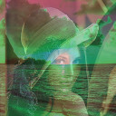

==========
Quickstart
==========

These sample programs illustrate how to access and manipulate pixel data in the bitmap:

Example 1
=========
Brightness adjustment:

.. image:: frob.jpg

.. code-block:: c

    #include <libwinbmp.c>
    #include <stdio.h>
    #define STEP 64

    int main(void)
    {
        bmp_t *bmp;
        bmp = bmp_load("/home/jakub/bmp-parser/lena.bmp");
        unsigned int row_size = bmp->info.width * 3;
        unsigned int x;
        unsigned int y;
        int d;

        for (y = 0; y < bmp->info.height; y++) {
            for (x = 0; x < row_size; x++) {
                d = (int)bmp->data[y][x] + STEP;
                if (d > 255) {
                    d = 255;
                } else if (d < 0) {
                    d = 0;
                }
                bmp->data[y][x] = (unsigned char)d;
            }
        }
            
        bmp_write(bmp,"/home/jakub/bmp-parser/frob.bmp");
        bmp_destroy(bmp);
        return 0;
    }

Example 2
=========
Averaging two images:

.. code-block:: c

    #include <libwinbmp.c>
    #include <stdio.h>

    int main(void)
    {
        bmp_t *bmp;
        bmp_t *other;
        bmp = bmp_load("/home/jakub/bmp-parser/lena.bmp");
        other = bmp_load("/home/jakub/bmp-parser/beach.bmp");

        bmp_average(bmp, other);

        bmp_write(bmp,"/home/jakub/bmp-parser/frob.bmp");
        bmp_destroy(bmp);
        bmp_destroy(other);
        return 0;
    }

